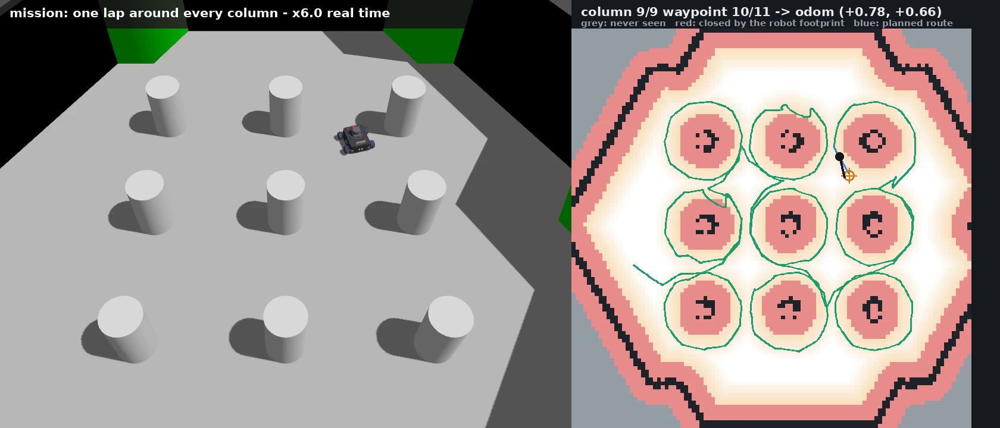
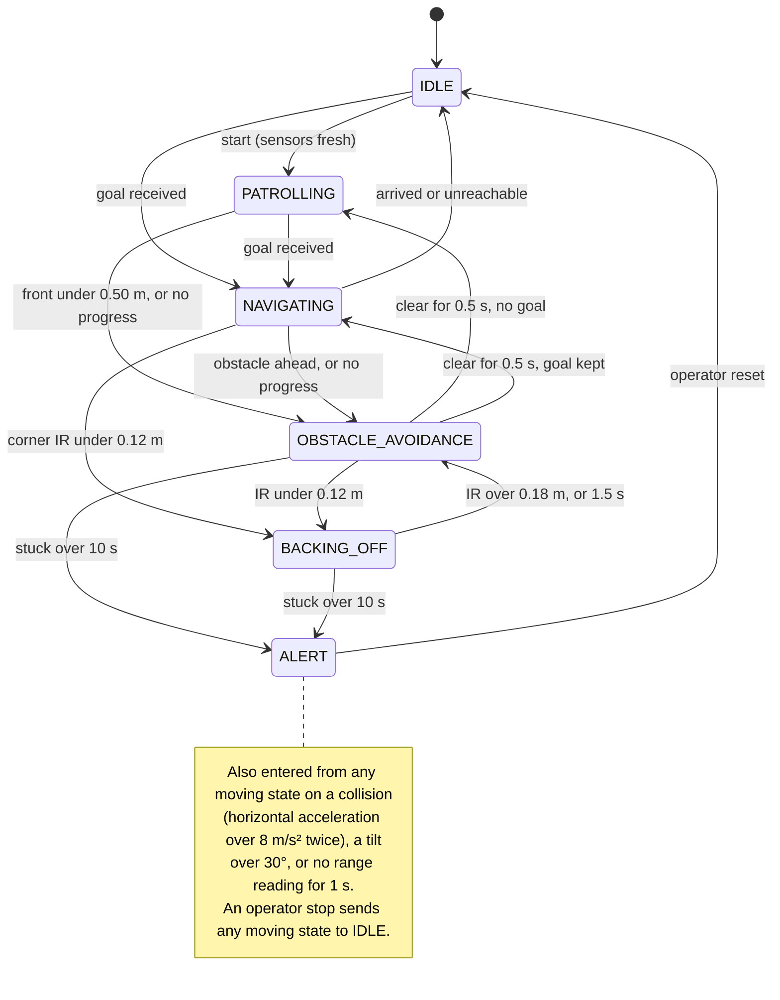
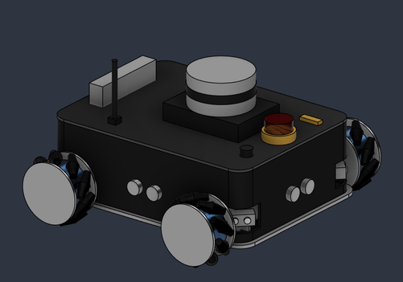
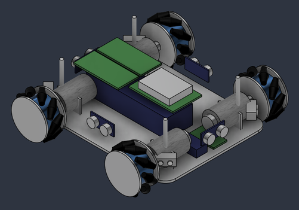
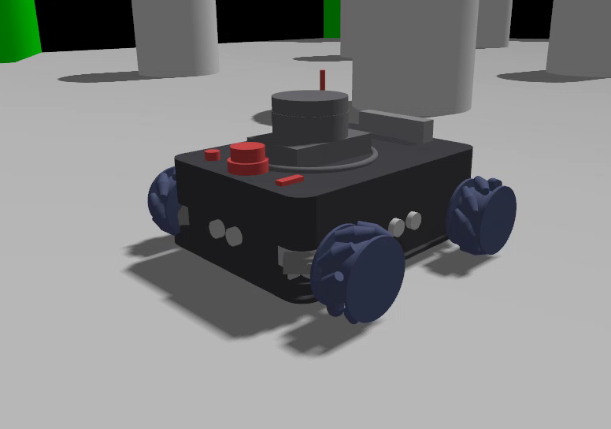

# SentinelBot: an FSM patrol robot for ROS 2

`sentinel_patrol` is a ROS 2 package for an autonomous security patrol robot controlled by a finite
state machine. The robot patrols, turns away from obstacles, reverses out of close contacts, drives to
goals over a map it builds itself, and stops with an alert on a collision, a tip-over, a stuck
manoeuvre or a silent sensor. It runs on the stock TurtleBot3 Burger or on SentinelBot Mk II, a
mecanum-wheeled robot modelled for this project, in Gazebo Harmonic with ROS 2 Jazzy.

Coursework for *Advanced Robot Applications*, MSc in Artificial Intelligence, Berlin School of
Business and Innovation. Author: Artem Zenkevich.

**Video:** [SentinelBot in Gazebo, 8 min](https://youtu.be/0XrHwnqzorY). Every state and
transition in one run, then the patrol mission around the columns and the three harder arenas.



## The state machine



All 21 transitions are written out, one comment each, in
[`sentinel_patrol/fsm_core.py`](sentinel_patrol/fsm_core.py). Every threshold on the diagram is a ROS
parameter in [`config/patrol_params.yaml`](config/patrol_params.yaml).

## The robot: SentinelBot Mk II

| Fusion model | Shell hidden | In Gazebo |
|---|---|---|
|  |  |  |

Mk II is a four-wheel mecanum patrol robot modelled in Autodesk Fusion (19 components, 124 bodies).
The Gazebo model in [`models/sentinel_mk2/`](models/sentinel_mk2/) is built from that design: each
visual is the STL export of one Fusion component, and every sensor sits where the CAD puts it.
Mecanum wheels let the robot move sideways without turning, and the FSM uses this in holonomic mode
(`holonomic:=true`): OBSTACLE_AVOIDANCE slides past a narrow obstacle instead of rotating in front
of it.

| Dimensions and mass | |
|---|---|
| Size over the wheels | 262 × 286 × 176 mm |
| Chassis shell | 250 × 190 × 82 mm |
| Wheelbase / track | 180 / 248 mm |
| Wheels | 4 mecanum wheels in X layout, Ø80 × 38 mm, 9 rollers each |
| Ground clearance | 20 mm |
| Mass | 3.98 kg dry, centre of mass 54 mm above the floor, 1.0 kg payload allowance |
| Footprint | fits a circle of radius 0.176 m at any heading, the planner's `robot_radius` |
| Drive | 4 × JGB37-520 gearmotors |
| Battery | 3S LiPo, 8000 mAh (88.8 Wh), enough for about 3.1 h of patrol |
| Computers | Raspberry Pi 5 for ROS 2, ESP32 for the wheel control loop |

| Sensor | Part | Range | Height above the floor | What the FSM does with it |
|---|---|---|---|---|
| LiDAR, 360° | Slamtec RPLIDAR A1M8 | 0.15–12 m | 142 mm | the map and the planner |
| Ultrasonic × 4 | HC-SR04 | 0.02–4 m | 52 mm | stop distance ahead; side and rear clearance in holonomic mode |
| Infrared × 4 | Sharp GP2Y0A21YK0F | 0.10–0.80 m | 45 mm | corner pods at ±45°: turn direction and BACKING_OFF |
| IMU | BNO085, 9-axis, 100 Hz | – | 23 mm | collision and tilt, which raise ALERT |
| Depth camera | Luxonis OAK-D Lite | 0.2–12 m | 112 mm | fitted but not used by the FSM |

The ultrasonic and infrared sensors sit low on purpose: nothing below the LiDAR's scan plane at
142 mm shows up in its scan, whether a kerb, a cable duct or a foot.

Before anything was simulated, the design was checked by calculation:

| Check | Result | Verdict |
|---|---|---|
| Speed | 1.17 m/s nominal; the fastest mission speed, 0.30 m/s, is 20 % of rated | pass |
| Torque, flat floor | 0.061 N·m per wheel, a 2.5× margin to the motor's nominal torque | pass |
| Torque, 6° ramp | 0.116 N·m per wheel, only a 1.3× margin: no reserve for accelerating uphill | marginal |
| Traction | wheels slip at 5.9 m/s², long before tipping at 16.3 m/s² | pass |
| Stability | tips at 66° sideways and 59° forwards; ALERT fires at 30° | pass |
| Energy | 23.3 W while driving, 3.1 h of patrol from 71 Wh usable | pass |
| Electrical | 16 A worst case under a 20 A fuse | pass |
| Turning | 5.5 rad/s available, the FSM turns at 0.60 rad/s | pass |
| Sensor coverage | the 15° ultrasonic cone is 132 mm wide at 0.5 m; infrared covers the corners | pass |

**Drive.** A body velocity command becomes four wheel speeds through the mecanum inverse kinematics
(l<sub>x</sub> + l<sub>y</sub> = 0.214 m, r the wheel radius), which the ESP32 runs on the real robot:

```
w_FL = (vx - vy - (lx+ly)*wz) / r        w_FR = (vx + vy + (lx+ly)*wz) / r
w_RL = (vx + vy - (lx+ly)*wz) / r        w_RR = (vx - vy + (lx+ly)*wz) / r
```

In Gazebo, `mecanum_base_sim` turns the wheel joints with the same formulas, fed the measured body
velocity. Read back from `/joint_states`, the wheel rates in rad/s match the kinematics to within 1 %:

| Command | FL | FR | RL | RR | Kinematics |
|---|---|---|---|---|---|
| forward 0.15 m/s | +3.59 | +3.59 | +3.59 | +3.59 | all +3.57 |
| strafe left 0.15 m/s | −3.60 | +3.59 | +3.59 | −3.60 | ±3.57, diagonal pairs |
| rotate 0.6 rad/s | −3.03 | +3.03 | −3.07 | +3.07 | ±3.06, left pair against right |

**What the simulation fakes.** Gazebo does not model the rollers: neither physics engine in this build
supports the anisotropic friction they need, and the kinematic velocity controller corrupts the IMU
with a constant −9.8 m/s² while moving. So the chassis is a free rigid body with the design's mass and
inertia (4.0 kg), and `mecanum_base_sim` pushes it with the force and torque the four wheels would
produce, through a PI velocity loop limited to 0.6 m/s² and 2 rad/s². Contacts, tipping and the IMU
stay physical, which the ALERT state needs. Measured from odometry, a 0.15 m/s command gives 0.150 m/s
forwards, backwards and sideways, 0.60 rad/s gives 0.59–0.61 rad/s, the robot stops from patrol speed
in under 0.3 s, and the IMU stays below 0.4 m/s² in normal manoeuvres against the 8 m/s² threshold.

**Cost.** USD 812 in parts: USD 564 for the base robot (drivetrain, compute, power, structure and the
ultrasonic, infrared and IMU sensors the FSM reads), USD 99 for the LiDAR and USD 149 for the depth
camera.

## What is where

| Path | Contents |
|---|---|
| `sentinel_patrol/fsm_core.py` | The state machine. Plain Python with no ROS import, one method per state |
| `sentinel_patrol/patrol_fsm_node.py` | The ROS 2 node around it: sensor subscriptions, the 10 Hz loop, `/cmd_vel`, `/robot_alert`, `/patrol_state` |
| `sentinel_patrol/scan_to_range_node.py` | Converts LiDAR scans into `sensor_msgs/Range` readings emulating an HC-SR04 ultrasonic and Sharp infrared sensors |
| `sentinel_patrol/occupancy_mapper_node.py` | Occupancy grid on `/map` built from `/scan` and `/odom` |
| `sentinel_patrol/path_planner_node.py` | Costmap inflated by the chassis footprint, A* route on `/path_planned` |
| `sentinel_patrol/column_tour_node.py` | Mission sequencer: a lap around every column, sent as goals on `/goal_pose` |
| `sentinel_patrol/mecanum_base_sim_node.py` | Base controller for the Mk II model in Gazebo |
| `sentinel_patrol/pilot/` | The optional learned velocity policy for NAVIGATING: a small MLP trained by imitating an MPPI controller, and the surrogate model of the base it was trained in |
| `launch/` | `patrol.launch.py` (FSM, sensor adapter, mapper, planner, optional RViz) and `sentinel_gazebo.launch.py` (Gazebo with the Mk II) |
| `models/sentinel_mk2/` | The Mk II robot: SDF with STL meshes from the CAD design, a 360° LiDAR, four ultrasonic, four infrared sensors and an IMU |
| `worlds/` | The TurtleBot3 arena for the Mk II, and three generated arenas (`warehouse`, `corridors`, `forest`) |
| `config/` | Parameters, the Gazebo bridge configuration, and the trained pilot weights |
| `test/` | pytest suites that import no ROS code |
| `tools/` | Demo and recording scripts, figure generators, pilot training |
| `docs/robot/` | Renders of the Mk II design and a still of its Gazebo model |
| `docs/` | Archived runs: logs, screenshots and videos (listed [below](#archived-runs)) |

## Requirements

* **Unit tests only:** Python 3.10 or newer with numpy and pytest, on any operating system.
* **Simulation:** Ubuntu 24.04 with ROS 2 Jazzy and Gazebo Harmonic. Tested under WSL2 on
  Windows 11, where the Gazebo and RViz windows appear through WSLg.

  ```bash
  sudo apt install ros-jazzy-desktop ros-jazzy-ros-gz ros-jazzy-turtlebot3-gazebo \
                   python3-colcon-common-extensions python3-scipy
  ```

* **Recording scripts in `tools/`:** also `ffmpeg`, `python3-pil` and `python3-matplotlib`.

On ROS 2 Humble the FSM node publishes the plain `geometry_msgs/Twist` that the Humble TurtleBot3
simulation expects (the default, `cmd_vel_stamped:=false`), but that combination has not been
tested. The Mk II model and the scripts in `tools/` are written for Gazebo Harmonic, and
every archived run was recorded on Jazzy.

## 1. Unit tests, no ROS needed

```bash
git clone https://github.com/CrossEyedCat/SentinelBot.git sentinel_patrol
cd sentinel_patrol
python3 -m pip install -r requirements.txt     # on Ubuntu: sudo apt install python3-numpy python3-pytest
python3 -m pytest test/ -v
```

On Windows use `python` instead of `python3`. All 68 tests should pass: 49 for the state machine
and 19 for the learned pilot.

## 2. Build the package

```bash
mkdir -p ~/ros2_ws/src && cd ~/ros2_ws/src
git clone https://github.com/CrossEyedCat/SentinelBot.git sentinel_patrol
cd ~/ros2_ws
source /opt/ros/jazzy/setup.bash
colcon build --packages-select sentinel_patrol --symlink-install
source install/setup.bash
```

`rosdep install --from-paths src --ignore-src -y` installs anything missing. The scripts in
`tools/` look for the workspace in `~/ros2_ws`; export `ROS_WS=/path/to/workspace` if yours is
elsewhere. Every terminal below starts with `source ~/ros2_ws/install/setup.bash`.

## 3. Patrol with the stock TurtleBot3

```bash
# terminal 1: Gazebo with the TurtleBot3 world
export TURTLEBOT3_MODEL=burger
ros2 launch turtlebot3_gazebo turtlebot3_world.launch.py

# terminal 2: the FSM, the sensor adapter, the mapper and the planner
ros2 launch sentinel_patrol patrol.launch.py cmd_vel_stamped:=true

# terminal 3: the operator
ros2 topic pub --once /patrol_cmd std_msgs/msg/String "{data: start}"
ros2 topic echo /patrol_state
```

`cmd_vel_stamped:=true` is required on Jazzy, whose TurtleBot3 bridge expects `TwistStamped` on
`/cmd_vel`; leave it out on Humble. The robot leaves IDLE, drives until a pillar enters the stop band
and turns away from it. Terminal 2 logs every transition with the reading that caused it:

```
[patrol_fsm]: [FSM] IDLE -> PATROLLING | trigger operator = 1.00 start
[patrol_fsm]: [FSM] PATROLLING -> OBSTACLE_AVOIDANCE | trigger ultrasonic.front = 0.45
[patrol_fsm]: [FSM] OBSTACLE_AVOIDANCE -> PATROLLING | trigger ultrasonic.front = 1.29
```

The operator commands on `/patrol_cmd` are `start`, `stop` and `reset`; alerts arrive on
`/robot_alert` as `ALERT reason=<REASON> sensor=<source> value=<reading> from=<state>`. An alert
holds the robot until `reset`, and one can fire in an ordinary run: in one TurtleBot3 check the IMU
reported a `COLLISION` (37 m/s²) during an avoidance turn after about a minute of patrol.

## 4. SentinelBot Mk II, the map and click-to-drive

```bash
# terminal 1: Gazebo with the Mk II (add gui:=false to run without the Gazebo window)
ros2 launch sentinel_patrol sentinel_gazebo.launch.py

# terminal 2: the FSM in holonomic mode, one Range topic per physical sensor, RViz
ros2 launch sentinel_patrol patrol.launch.py holonomic:=true sensor_mode:=per_sensor rviz:=true
```

The map fills in as the robot moves. In RViz choose **2D Goal Pose** and click a free cell: the
planner routes around the columns and the FSM drives there in NAVIGATING, then returns to IDLE.
Sending `start` patrols instead. The Mk II base takes plain `Twist`, so do not add
`cmd_vel_stamped:=true` here.

## 5. Provoking each transition

`tools/record_fsm_demo.sh ~/fsm_transitions.mp4` runs the Mk II through every state in one headless
Gazebo session (about four minutes) and films it, with the overview camera on the left and the
FSM's state, sensor readings and own log on the right. It acts only as an operator or the world
could: commands, a goal, boxes placed in the world, a pose set in Gazebo, a push, a stopped node.
[`docs/evidence_planner/fsm_transitions.mp4`](docs/evidence_planner/fsm_transitions.mp4) is the
recorded run and `docs/evidence_planner/fsm_demo_log/` its logs.

By hand, with the stack from section 3 or 4 running:

| Transition | How to cause it |
|---|---|
| IDLE → PATROLLING | `ros2 topic pub --once /patrol_cmd std_msgs/msg/String "{data: start}"` |
| PATROLLING → OBSTACLE_AVOIDANCE | let the robot drive at a pillar |
| OBSTACLE_AVOIDANCE → BACKING_OFF | place a box against a front corner, inside 0.12 m of an infrared sensor |
| moving → ALERT, STUCK | box the robot in so that no turn frees it for 10 s |
| moving → ALERT, TIPPING | tilt the robot past 30° with the Gazebo rotate tool |
| moving → ALERT, COLLISION | `ros2 param set /patrol_fsm imu_accel_spike 2.0`, then strike the robot from the side |
| moving → ALERT, SENSOR_LOST | stop the adapter while the robot drives: `pkill -f lib/sentinel_patrol/scan_to_range` |
| ALERT → IDLE | `ros2 topic pub --once /patrol_cmd std_msgs/msg/String "{data: reset}"` |
| IDLE → NAVIGATING → IDLE | a 2D Goal Pose click in RViz, or a `geometry_msgs/PoseStamped` on `/goal_pose` |

`tools/run_demo.sh` records a free patrol with a Gazebo screenshot at every state change and a
tipping event at the end, into `~/sentinel_demo/<timestamp>/`: `ROBOT=tb3 tools/run_demo.sh 90` for
the TurtleBot3, `tools/run_demo.sh 120` for the Mk II. It needs the Gazebo window.
`docs/evidence_jazzy_run/` and `docs/evidence_mk2_run/` are two such runs.

## 6. The column mission and the harder arenas

```bash
tools/record_column_tour.sh ~/column_tour.mp4 2400                                  # point goals
MODE=continuous tools/record_column_tour.sh ~/tour_continuous.mp4 2400              # whole lap, hand law
MODE=pilot tools/record_column_tour.sh ~/tour_pilot.mp4 2400                        # MLP pilot
MAP=warehouse MODE=pilot tools/record_column_tour.sh ~/warehouse.mp4 2400
```

Each run starts its own headless Gazebo with the Mk II, sends a lap around every column through
`/goal_pose`, and films it at six times real time with the costmap beside the camera. The mission
log is copied next to the video as `mission_log/`, and `python3 tools/mission_motion.py <dir>/mission_log`
summarises it. `MAP` also takes `corridors` and `forest` (`python3 tools/make_worlds.py` regenerates
them). For the lap the recorder lowers the stop distances on the running node, because the ring
passes within 0.4 m of each column; `config/patrol_params.yaml` stays as it is. A learned pilot only
sets the velocity inside NAVIGATING, and every transition of the state machine still applies to it.
`python3 tools/train_pilot.py` trains it again (about 20 minutes on a laptop CPU).

## Topics

| Topic | Type | Direction | Role |
|---|---|---|---|
| `/ultrasonic` | `sensor_msgs/Range` | in | front distance: the stop condition while driving |
| `/ir_left`, `/ir_right` | `sensor_msgs/Range` | in | turn direction and the BACKING_OFF trigger |
| `/ultrasonic_rear`, `/ultrasonic_left`, `/ultrasonic_right` | `sensor_msgs/Range` | in | holonomic mode only |
| `/imu` | `sensor_msgs/Imu` | in | collision spike and tilt |
| `/odom` | `nav_msgs/Odometry` | in | pose, for goals and the progress watchdog |
| `/patrol_cmd` | `std_msgs/String` | in | `start`, `stop`, `reset` |
| `/goal_pose` | `geometry_msgs/PoseStamped` | in | destination, e.g. RViz 2D Goal Pose |
| `/cmd_vel` | `geometry_msgs/Twist` (`TwistStamped` with `cmd_vel_stamped:=true`) | out | velocity command |
| `/patrol_state` | `std_msgs/String` | out | current state, every tick |
| `/robot_alert` | `std_msgs/String` | out | reason, sensor, value and previous state of each alert |
| `/goal_status` | `std_msgs/String` | out | `ACCEPTED`, `REFUSED`, `GOAL_REACHED`, `GOAL_UNREACHABLE` |
| `/map`, `/costmap` | `nav_msgs/OccupancyGrid` | out | occupancy grid, and the grid inflated by the footprint |
| `/path_planned`, `/path_travelled`, `/path_to_goal` | `nav_msgs/Path` | out | A* route, trail driven, line being followed |
| `/plan_status` | `std_msgs/String` | out | `OK points=n` or `NO_PATH <reason>` |

## Parameters

Every threshold is a ROS parameter, so it can be changed on a running robot:

```bash
ros2 param list /patrol_fsm
ros2 param set /patrol_fsm d_stop 0.6
```

| Parameter | Default | Meaning |
|---|---|---|
| `d_stop`, `d_clear` | 0.50 m, 0.70 m | front distance that starts avoidance, and the clearance that ends it |
| `ir_critical`, `ir_back_exit` | 0.12 m, 0.18 m | infrared distance that starts reversing, and the one that ends it |
| `n_confirm` | 3 | consecutive readings needed for a range-triggered transition |
| `imu_accel_spike`, `n_imu_confirm` | 8.0 m/s², 2 | horizontal acceleration for COLLISION, and samples needed |
| `imu_tilt_max` | 30° | tilt for TIPPING |
| `t_avoid_max` | 10 s | longest avoidance episode before STUCK |
| `sensor_timeout` | 1 s | silence on the front ultrasonic before SENSOR_LOST |
| `stuck_dist`, `t_stuck` | 0.05 m, 4 s | progress watchdog while driving |
| `v_patrol`, `w_turn`, `v_back` | 0.15 m/s, 0.60 rad/s, 0.08 m/s | patrol, turn and reverse speeds |
| `goal_tolerance` | 0.10 m | arrival distance in NAVIGATING |

## Archived runs

| Folder | Run |
|---|---|
| `docs/evidence_jazzy_run/` | TurtleBot3 free patrol followed by a tipping event: a screenshot per state change, the transition log and a timeline |
| `docs/evidence_mk2_run/` | Mk II free patrol with a BACKING_OFF episode, then tipping |
| `docs/evidence_map_run/` | the map built while patrolling, then a clicked goal reached |
| `docs/evidence_planner/` | the costmap and A* route; every transition in one run (`fsm_transitions.mp4`, `fsm_demo_log/`) |
| `docs/evidence_planner/maps/` | the three generated arenas (`arenas.png`), with the mission logs and films of the waypoint, continuous and pilot runs in them |
| `docs/evidence_planner/` (controllers) | the base-arena mission driven three ways: films `column_tour.mp4` (waypoints), `tour_continuous.mp4` and `tour_pilot.mp4` (learned pilot), the pilot's log `mission_log_pilot/`, the closing costmaps in `paths/`, and `base_controllers_recorded.json` for the two runs whose logs were not kept |
| `docs/evidence_planner/pilot_training.json` | the learned pilot's training, stage by stage, and the controllers on the same unseen laps (`python3 tools/train_pilot.py --record`) |

`python3 tools/report_figures.py --out figures` redraws the report's eight figures from these files
and the renders in `docs/robot/` (needs matplotlib and Pillow); nothing is simulated again.

## Troubleshooting

* **The TurtleBot3 does not move on Jazzy.** Add `cmd_vel_stamped:=true` to `patrol.launch.py`. The
  Mk II is the opposite: it needs the default plain `Twist`.
* **The FSM stays in IDLE after `start`.** It waits for fresh ultrasonic and IMU readings; check that
  `/ultrasonic` and `/imu` are publishing (`ros2 topic hz /ultrasonic`).
* **Nothing is visible from another terminal while a recording script runs.** The scripts in `tools/`
  use ROS domain 7 unless `ROS_DOMAIN_ID` is set; export the same value in that terminal.
* **A recording script stopped another simulation.** Before it starts, each script kills any running
  `gz sim`, `patrol_fsm` and the other nodes of this package, so run it on its own.

## Licence

MIT, see [LICENSE](LICENSE).
